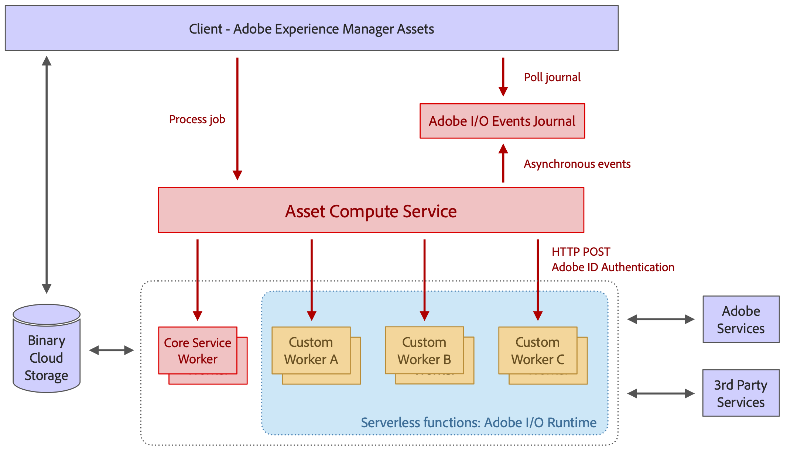

# 架构 [!DNL Asset Compute Service] {#overview}

此 [!DNL Asset Compute Service] 基于无服务器构建 [!DNL Adobe I/O] 运行时平台。 它为Assets提供Adobe Sensei内容服务支持。 调用客户端(仅 [!DNL Experience Manager] as a [!DNL Cloud Service] （受支持）以及为该资产查找的Adobe Sensei生成的信息一起提供。 返回的信息采用JSON格式。

[!DNL Asset Compute Service] 可通过基于创建自定义应用程序进行扩展 [!DNL Project Adobe Developer App Builder]. 这些自定义应用程序是 [!DNL Project Adobe Developer App Builder] Headless应用程序并执行添加自定义转换工具或调用外部API以执行图像操作等任务。

[!DNL Project Adobe Developer App Builder] 是一个用于在其上构建和部署自定义Web应用程序的框架 [!DNL Adobe I/O] 运行时。 要创建自定义应用程序，开发人员可以利用 [!DNL React Spectrum] (Adobe的UI工具包)、创建微服务、创建自定义事件和编排API。 参见 [Adobe Developer App Builder文档](https://developer.adobe.com/app-builder/docs/overview).

该体系结构所基于的基础包括：

* 应用程序的模块性（仅包含给定任务所需的内容）允许应用程序相互分离，并保持轻量级。

* 无服务器的概念 [!DNL Adobe I/O] 运行时具有许多好处：异步、高度可扩展、隔离、基于作业的处理，非常适合资产处理。

* 二进制云存储使用预签名的URL引用，提供了单独存储和访问资产文件和演绎版所需的功能，而无需具有对存储的完全访问权限。 传输加速、CDN缓存和将计算应用程序与云存储放在一起允许最佳的低延迟内容访问。 同时支持AWS和Azure云。

*图：架构 [!DNL Asset Compute Service] 以及它如何与集成 [!DNL Experience Manager]、存储和处理应用程序。*

该架构包含以下部分：

* **API和编排层** 接收（JSON格式）请求，这些请求指示服务将源资源转换为多个演绎版。 这些请求是异步执行的，且会返回一个激活ID，即作业ID。 指令是纯声明性的，对于所有标准处理工作（如缩览图生成、文本提取），使用者仅指定所需的结果，而不指定处理特定演绎版的应用程序。 通用API功能（如身份验证、分析、速率限制）使用服务前的AdobeAPI网关处理，并管理所有发送到的 [!DNL Adobe I/O] 运行时。 应用程序路由由协调层动态完成。 自定义应用程序可由客户端为特定呈现版本指定，并包括自定义参数。 应用程序执行可以完全并行，因为它们是中单独的无服务器函数 [!DNL Adobe I/O] 运行时。

* **用于处理资产的应用程序** 专门处理特定类型的文件格式或目标格式副本。 从概念上讲，应用程序类似于Unix管道概念：输入文件被转换为一个或多个输出文件。

* **A [公共应用程序库](https://github.com/adobe/asset-compute-sdk)** 处理下载源文件、上传演绎版、错误报告、事件发送和监控等常见任务。 这种设计旨在使应用程序的开发遵循无服务器思想，尽可能保持简单，并且可以限制为本地文件系统交互。

<!-- TBD:

* About the YAML file?
* minimize description to custom applications
* remove all internal stuff (e.g. Photoshop application, API Gateway) from text and diagram
* update diagram to focus on 3rd party custom applications ONLY
* Explain important transactions/handshakes?
* Flow of assets/control? See the illustration on the Nui diagrams wiki.
* Illustrations. See the SVG shared by Alex.
* Exceptions? Limitations? Call-outs? Gotchas?
* Do we want to add what basic processing is not available currently, that is expected by existing AEM customers?
-->
